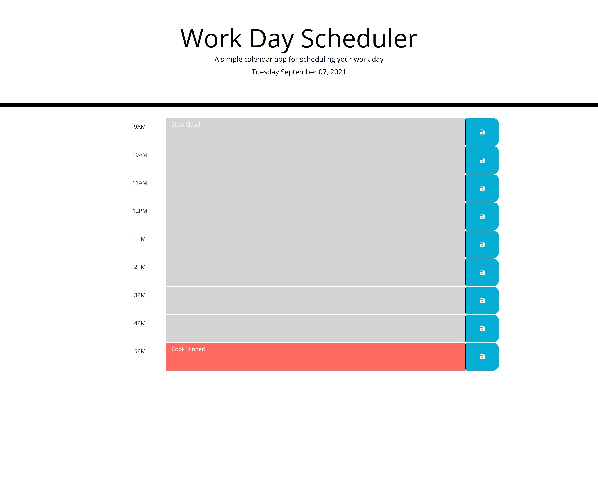

# Hourly Work Planner 
 
[Link to LIVE site.](https://ashbylb.github.io/workday-scheduler/)

## Table of Contents
- [Description](#Description)
- [Usage](#Usage)
- [Screenshot](#Screenshot)
- [Languages](#Languages)
- [License](#License)
- [Languages](#Contact)

## Discription
Hello.  Thanks you for using the Hourly Work Planner! Feel free to input your plans for the day and rest assured they will be saved until you decide to change them.

## Usage 
To navigate the page, click on the text area next to the hour you need to add plans.  Add your plans into the text field and then click the save button to the right!  That is all you have to do and the browser will save your plans until you change them again!

## Screenshot
 

## Languages
HTML, CSS, JavaScript, JQuery, Bootstrap, and FontAwesome 

## License
MIT

## Contact
You can contact me with any questions at ashbyleeblakely@gmail.com

